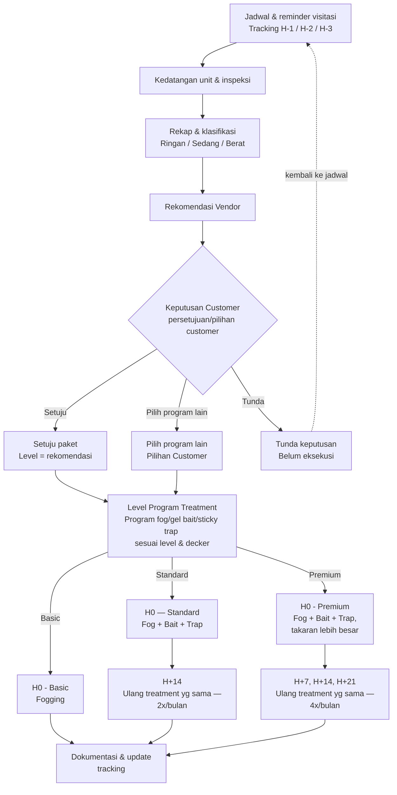

# WorkflowBugHunter

# Pest Control for Bus
Alur operasional pengendalian hama khusunya kkecoak untuk armada bus, dari penjadwalan sampai dokumentasi tracking.
Referensi: form inspeksi & rekomendasi tingkat infestasi kecoa dan jadwal fogging unit divisi Malang

## Alur proses

### Catatan alur
- Treatment terjadi sejak H0
- **Basic** = one-time treatment (fogging saja), selesai langsung di H0, tidak masuk cadence lanjut
- **Standard** → fogging + gel bait + sticky trap sejak H0, diulang di H+14 (2x/bulan)
- **Premium** → fogging + gel bait + sticky trap (porsi lebih banyak) sejak H0, diulang di H+7, H+14, H+21 (4x/bulan)
- **Persetujuan Program Treatment** dan **Eksekusi Treatment** terjadi di visit yang sama (H0) — bukan proses terpisah
- **Pilih program lain** vs **Diskresi komposisi lapangan** adalah dua hal berbeda:
  - *Pilih program lain* = keputusan customer soal **level paket program** (basic/standard/premium), dicatat sebagai Pilihan Customer
  - *Diskresi lapangan* = penyesuaian **komposisi material** (fog/bait/trap) di visit tertentu, independen dari level mana yang dipilih, berdasarkan koordinasi TR&D dan PIC Lapangan
- **H+28** bukan tahap treatment, jadi jika H+28 akan reorder dihitung sebagai H0 baru

## Skema database (ERD) 

```mermaid
erDiagram
    CUSTOMER ||--o{ CUSTOMER_CABANG : has
    CUSTOMER_CABANG ||--o{ BUS : owns
    GARASI ||--o{ JADWAL_VISITASI : hosts
    BUS ||--o{ JADWAL_VISITASI : scheduled
    JADWAL_VISITASI ||--o{ PLOTTING : assigns
    PERSONEL ||--o{ PLOTTING : assigned_to
    JADWAL_VISITASI ||--o{ INSPEKSI : produces
    INSPEKSI ||--o{ INSPEKSI_AREA : scores
    AREA ||--o{ INSPEKSI_AREA : scored_in
    BUS ||--o{ PAKET_TREATMENT : has
    PAKET_TREATMENT ||--o{ TREATMENT_VISIT : includes
    TREATMENT_VISIT ||--o{ PEMAKAIAN_BAHAN : uses
    BAHAN ||--o{ PEMAKAIAN_BAHAN : consumed_in
    BUS ||--o{ INVOICE : billed
 
    CUSTOMER {
        uuid id PK
        string nama
    }
    CUSTOMER_CABANG {
        uuid id PK
        uuid customer_id FK
        string nama_cabang
        string wilayah
        string pic_approval
        string info_pembayaran
    }
    BUS {
        uuid id PK
        string kode_unik
        uuid cabang_id FK
        string nama_bus
        string no_polisi
        string model_bis
        string type_unit
        string seri
        string keterangan
    }
    GARASI {
        uuid id PK
        string nama_garasi
        string kota
        string wilayah
    }
    JADWAL_VISITASI {
        uuid id PK
        uuid bus_id FK
        uuid garasi_id FK
        date tanggal
        time jam_estimasi
        time jam_kedatangan_aktual
        time jam_mulai_fogging_aktual
        time jam_berangkat_aktual
        string situasi_fogging
        string keterangan
    }
    PLOTTING {
        uuid id PK
        uuid jadwal_id FK
        uuid personel_id FK
        string alat_bahan
    }
    PERSONEL {
        uuid id PK
        string nama
        string role
    }
    INSPEKSI {
        uuid id PK
        uuid jadwal_id FK
        string tipe
        string jenis_armada
        bool punya_pantry
        bool punya_toilet
        bool punya_dispenser
        bool punya_sleeper_pod
        bool punya_rak_bagasi_atas
        bool punya_lantai_atas
        string kondisi_kebersihan_interior
        string kondisi_sumber_pangan
        string kondisi_kelembapan
        bool risiko_sisa_makanan
        bool risiko_banyak_sampah
        bool risiko_area_lembap
        bool risiko_celah_persembunyian
        int jumlah_area_diperiksa
        int jumlah_area_aktif
        int jumlah_lokasi_nimfa
        int jumlah_lokasi_ootheca
        int jumlah_lokasi_koloni_aktif
        string hasil_klasifikasi
    }
    AREA {
        uuid id PK
        string nama_area
        int urutan
    }
    INSPEKSI_AREA {
        uuid id PK
        uuid inspeksi_id FK
        uuid area_id FK
        int skor
    }
    PAKET_TREATMENT {
        uuid id PK
        uuid bus_id FK
        string level_rekomendasi_sistem
        string level_disepakati
        string status_approval
        string catatan_keputusan
        bool konfirmasi_risiko_diterima
        string pic_vendor
        string pic_customer
        date tanggal_mulai
    }
    TREATMENT_VISIT {
        uuid id PK
        uuid paket_id FK
        string hari_ke
        date tanggal
        bool inspeksi_done
        bool fogging_done
        bool dokumentasi_lengkap
        string catatan_lapangan
        string dokumentasi_before
        string dokumentasi_after
    }
    BAHAN {
        uuid id PK
        string nama_bahan
        string satuan
    }
    PEMAKAIAN_BAHAN {
        uuid id PK
        uuid treatment_visit_id FK
        uuid bahan_id FK
        float jumlah_standar
        float jumlah_aktual
    }
    INVOICE {
        uuid id PK
        uuid bus_id FK
        string periode
        float jumlah
        uuid checker_id FK
        string status
    }
```

### Catatan skema
 
- **Identitas bus**: `kode_unik` (format `{prefix_customer}{urutan}`, misal `MTrans001`) di-generate sistem dan jadi satu-satunya acuan permanen di seluruh relasi. `nama_bus` dan `no_polisi` sengaja diperlakukan sebagai atribut yang **bisa berubah** (plat nomor bisa dipindah ke bus lain), bukan kunci identitas.
- `BUS` sekarang murni master data (kode, nama, plat, model, type unit, seri, keterangan) — semua kondisi/fasilitas yang bisa dicek ulang tiap kunjungan dipindah ke `INSPEKSI`.
- `BUS.type_unit` (3 nilai: Single/Double Decker/Sleeper, master data) beda level detail dari `INSPEKSI.jenis_armada` (5 nilai checklist form: Single/Double Decker Executive/Sleeper, Hybrid) — yang kedua dicek ulang tiap inspeksi.
- `seri` nullable, belum jelas fungsinya — disimpan apa adanya sebagai string sampai dikonfirmasi ke tim lapangan.
- `INSPEKSI` sekarang mencakup seluruh isi form: fasilitas, kondisi umum unit (kebersihan interior/sumber pangan/kelembapan), faktor risiko operasional, checklist 16 area, dan temuan biologis. Faktor risiko (`risiko_*`) **tidak memengaruhi** `hasil_klasifikasi` — itu dasar rekomendasi sanitasi terpisah ke customer, sesuai catatan di form.
- `CUSTOMER` = brand (Mtrans, Medali Mas, Bagong). `CUSTOMER_CABANG` = cabang/wilayah di bawah brand, masing-masing dengan PIC approval dan info pembayaran sendiri. `BUS.cabang_id` nunjuk ke cabang, bukan langsung ke brand.
- `GARASI` dan `AREA` adalah master data — mencegah duplikasi/typo teks bebas.
- `JADWAL_VISITASI` punya waktu **realisasi** (`jam_kedatangan_aktual`, `jam_mulai_fogging_aktual`, `jam_berangkat_aktual`) terpisah dari `jam_estimasi`, plus `situasi_fogging` (shift) dan `keterangan`.
- `PAKET_TREATMENT.level_rekomendasi_sistem` vs `level_disepakati` memisahkan rekomendasi otomatis dari keputusan final customer.
- `TREATMENT_VISIT` punya `inspeksi_done`/`fogging_done` (checklist progres), `dokumentasi_lengkap` (boolean), dan `catatan_lapangan`.
- `PEMAKAIAN_BAHAN.jumlah_standar` vs `jumlah_aktual` menyimpan standar dari tabel matrix terpisah dari realisasi lapangan.
## Belum dimodelkan (open items)
 
- Hak akses per role (management / lapangan / customer) — termasuk apakah visitasi ke-2/ke-3 kelihatan ke customer atau cuma hasil akhir.
- Detail invoicing (checker vs printer vs penanggung jawab).
- Link supply chain ke keuangan (selisih pemakaian bahan vs pengadaan).
- Perhitungan lembur/insentif HR dari data `PLOTTING`.
- Validasi apakah wilayah `CUSTOMER_CABANG` selalu selaras dengan `GARASI`.
- Fungsi kolom `seri` pada `BUS` — belum dikonfirmasi.
- Apakah perubahan `no_polisi` pada bus yang sama perlu dicatat sebagai riwayat (audit trail).
