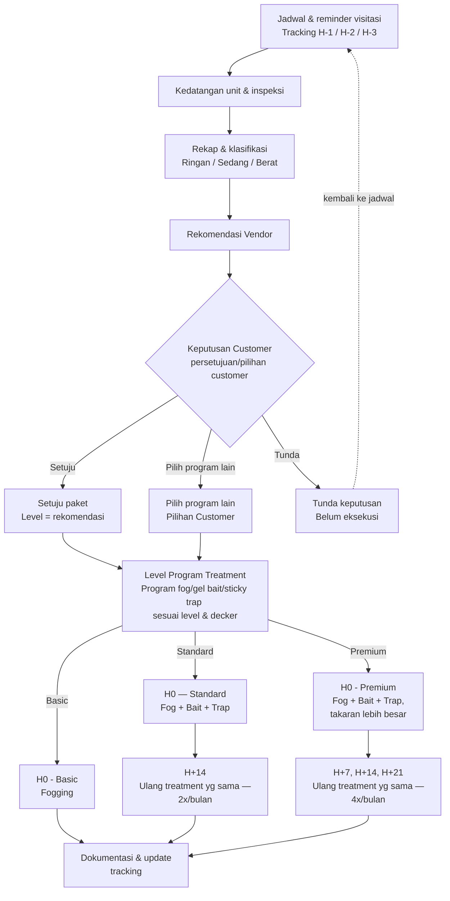

# WorkflowBugHunter

# Pest Control for Bus
Alur operasional pengendalian hama khusunya kkecoak untuk armada bus, dari penjadwalan sampai dokumentasi tracking.
Referensi: form inspeksi & rekomendasi tingkat infestasi kecoa dan jadwal fogging unit divisi Malang

## Alur proses

### Catatan alur
- Treatment terjadi sejak H0:
- **Basic** = one-time treatment (fogging saja), selesai langsung di H0, tidak masuk cadence lanjutan.
- **Persetujuan Program Treatment** dan **Eksekusi Treatment** terjadi di visit yang sama (H0) — bukan proses terpisah
- **Pilih program lain** vs **Diskresi komposisi lapangan** adalah dua hal berbeda:
  - *Pilih program lain* = keputusan customer soal **level paket program** (basic/standard/premium), dicatat sebagai Pilihan Customer
  - *Diskresi lapangan* = penyesuaian **komposisi material** (fog/bait/trap) di visit tertentu, independen dari leve mana yang dipilih
- **H+28** bukan tahap treatment — itu batas siklus. Reorder jadi H+28 dihitung sebagai H0 baru

- **Cabang komposisi treatment terjadi sejak H0**, bukan cuma di tahap cadence:
  - *Basic* → fogging saja, satu kali, selesai.
  - *Standard* → fogging + gel bait + sticky trap sejak H0, diulang di H+14 (2x/bulan).
  - *Premium* → fogging + gel bait + sticky trap (porsi lebih banyak) sejak H0, diulang di H+7, H+14, H+21 (4x/bulan).
- **Persetujuan tier** dan **eksekusi H0** terjadi di visit yang sama — bukan proses terpisah yang bisa menunda treatment.
- **Pilih program lain** vs **diskresi komposisi lapangan** adalah dua hal berbeda:
  - *Pilih program lain* = keputusan customer soal **tier** (basic/standard/premium), dicatat sebagai rekomendasi vendor vs pilihan customer.
  - *Diskresi lapangan* = penyesuaian **jumlah** material (titik gel bait, unit sticky trap) di visit tertentu — independen dari tier mana yang dipilih, berdasarkan koordinasi TR&D dan PIC lapangan.
- **H+28** bukan tahap treatment — itu batas siklus. Reorder setelah H+28 dihitung sebagai H0 baru.

### Catatan skema

- `PAKET_TREATMENT.level_rekomendasi_sistem` vs `level_disepakati` memisahkan rekomendasi otomatis dari keputusan final customer — memungkinkan tracking seberapa sering customer override rekomendasi.
- `PEMAKAIAN_BAHAN.jumlah_standar` vs `jumlah_aktual` menyimpan standar dari tabel matrix (level + jenis decker) terpisah dari realisasi lapangan, sesuai bagian "Jumlah Material Terpasang" di form inspeksi.
- `INSPEKSI_AREA` menyimpan skor 0–3 per area (16 area) — sumber data untuk menghitung `jumlah_area_aktif` di tabel `INSPEKSI`.
