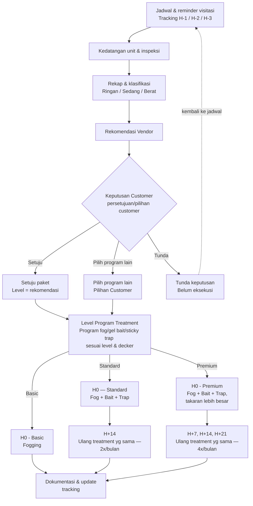
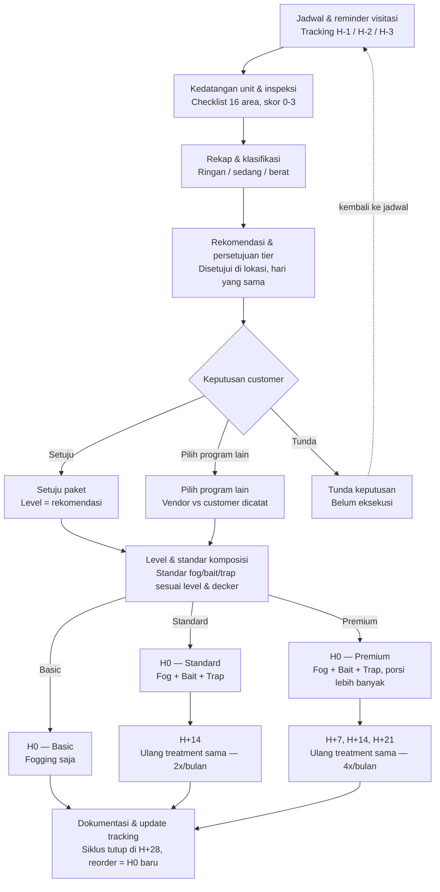
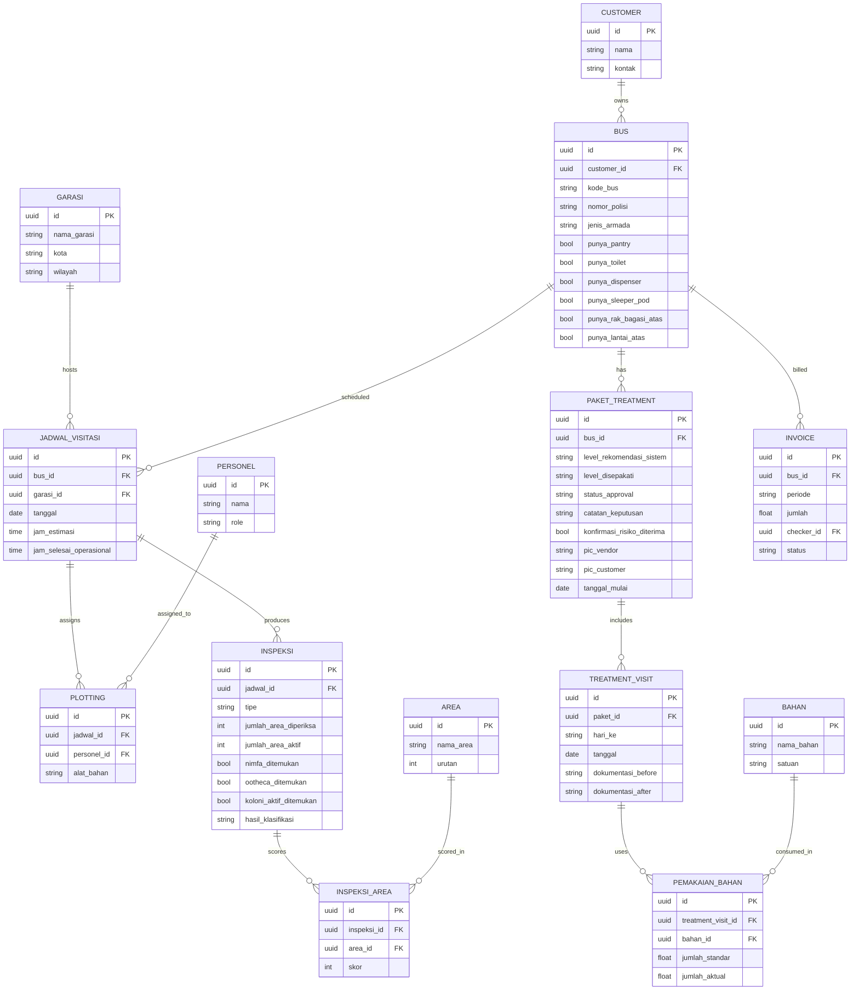

# WorkflowBugHunter

# Pest Control for Bus
Alur operasional pengendalian hama khusunya kkecoak untuk armada bus, dari penjadwalan sampai dokumentasi tracking.
Referensi: form inspeksi & rekomendasi tingkat infestasi kecoa dan jadwal fogging unit divisi Malang

## Alur proses

### Catatan alur
- Treatment terjadi sejak H0
- **Basic** = one-time treatment (fogging saja), selesai langsung di H0, tidak masuk cadence lanjut
- **Standard** → fogging + gel bait + sticky trap sejak H0, diulang di H+14 (2x/bulan)
- **Premium** → fogging + gel bait + sticky trap (porsi lebih banyak) sejak H0, diulang di H+7, H+14, H+21 (4x/bulan)
- **Persetujuan Program Treatment** dan **Eksekusi Treatment** terjadi di visit yang sama (H0) — bukan proses terpisah
- **Pilih program lain** vs **Diskresi komposisi lapangan** adalah dua hal berbeda:
  - *Pilih program lain* = keputusan customer soal **level paket program** (basic/standard/premium), dicatat sebagai Pilihan Customer
  - *Diskresi lapangan* = penyesuaian **komposisi material** (fog/bait/trap) di visit tertentu, independen dari level mana yang dipilih, berdasarkan koordinasi TR&D dan PIC Lapangan
- **H+28** bukan tahap treatment, jadi jika H+28 akan reorder dihitung sebagai H0 baru

# JHealth Pest Control — Bus Fogging Process

Alur operasional pengendalian hama (kecoak) untuk armada bus, dari penjadwalan sampai dokumentasi tracking. Referensi: form inspeksi, form persetujuan customer, dan jadwal fogging Divisi Malang.

## Alur proses

### Catatan alur

- **Cabang komposisi treatment terjadi sejak H0**, bukan cuma di tahap cadence:
  - *Basic* → fogging saja, satu kali, selesai.
  - *Standard* → fogging + gel bait + sticky trap sejak H0, diulang di H+14 (2x/bulan).
  - *Premium* → fogging + gel bait + sticky trap (porsi lebih banyak) sejak H0, diulang di H+7, H+14, H+21 (4x/bulan).
- **Persetujuan tier** dan **eksekusi H0** terjadi di visit yang sama — bukan proses terpisah yang bisa menunda treatment.
- **Pilih program lain** vs **diskresi komposisi lapangan** adalah dua hal berbeda:
  - *Pilih program lain* = keputusan customer soal **tier** (basic/standard/premium), dicatat sebagai rekomendasi vendor vs pilihan customer.
  - *Diskresi lapangan* = penyesuaian **jumlah** material (titik gel bait, unit sticky trap) di visit tertentu — independen dari tier mana yang dipilih, berdasarkan koordinasi TR&D dan PIC lapangan.
- **H+28** bukan tahap treatment — itu batas siklus. Reorder setelah H+28 dihitung sebagai H0 baru.

## Skema database (ERD)

### Catatan skema

- `BUS` murni data konfigurasi (kode, plat, jenis armada, fasilitas) — lokasi/garasi bukan atribut bus, tapi atribut per-visit di `JADWAL_VISITASI.garasi_id`.
- `GARASI` dan `AREA` adalah master data — mencegah duplikasi/typo teks bebas yang berulang di tiap baris inspeksi/jadwal.
- `PAKET_TREATMENT.level_rekomendasi_sistem` vs `level_disepakati` memisahkan rekomendasi otomatis dari keputusan final customer; selisih keduanya jadi indikator "pilih program lain".
- `PEMAKAIAN_BAHAN.jumlah_standar` vs `jumlah_aktual` menyimpan standar dari tabel matrix (level + jenis decker) terpisah dari realisasi lapangan (diskresi TR&D + PIC lapangan).
- `TREATMENT_VISIT.hari_ke` menyimpan label visit (H0, H+7, H+14, H+21) per paket (siklus) — Basic cukup satu baris `H0`, Standard/Premium beberapa baris sesuai cadence.

## Belum dimodelkan (open items)

Bagian ini sengaja belum jadi tabel — masih nunggu keputusan bisnis:

- Hak akses per role (management / lapangan / customer) — termasuk apakah visitasi ke-2/ke-3 kelihatan ke customer atau cuma hasil akhir.
- Detail invoicing (checker vs printer vs penanggung jawab).
- Link supply chain ke keuangan (selisih pemakaian bahan vs pengadaan).
- Perhitungan lembur/insentif HR dari data `PLOTTING`.

### Catatan skema

- `PAKET_TREATMENT.level_rekomendasi_sistem` vs `level_disepakati` memisahkan rekomendasi otomatis dari keputusan final customer — memungkinkan tracking seberapa sering customer override rekomendasi.
- `PEMAKAIAN_BAHAN.jumlah_standar` vs `jumlah_aktual` menyimpan standar dari tabel matrix (level + jenis decker) terpisah dari realisasi lapangan, sesuai bagian "Jumlah Material Terpasang" di form inspeksi.
- `INSPEKSI_AREA` menyimpan skor 0–3 per area (16 area) — sumber data untuk menghitung `jumlah_area_aktif` di tabel `INSPEKSI`.

- `PAKET_TREATMENT.level_rekomendasi_sistem` vs `level_disepakati` memisahkan rekomendasi otomatis dari keputusan final customer.
- `PEMAKAIAN_BAHAN.jumlah_standar` vs `jumlah_aktual` menyimpan standar dari tabel matrix (level + jenis decker) terpisah dari realisasi lapangan.
- `INSPEKSI_AREA` menyimpan skor 0–3 per area (16 area) — sumber data untuk menghitung `jumlah_area_aktif` di tabel `INSPEKSI`.
- `TREATMENT_VISIT.hari_ke` menyimpan label visit (H0, H+7, H+14, H+21) — komposisi per visit tetap merujuk ke `PEMAKAIAN_BAHAN`, jadi Basic (hanya H0, fogging) dan Standard/Premium (H0 + lanjutan, fog+bait+trap) sama-sama tercatat lewat struktur yang sama.
